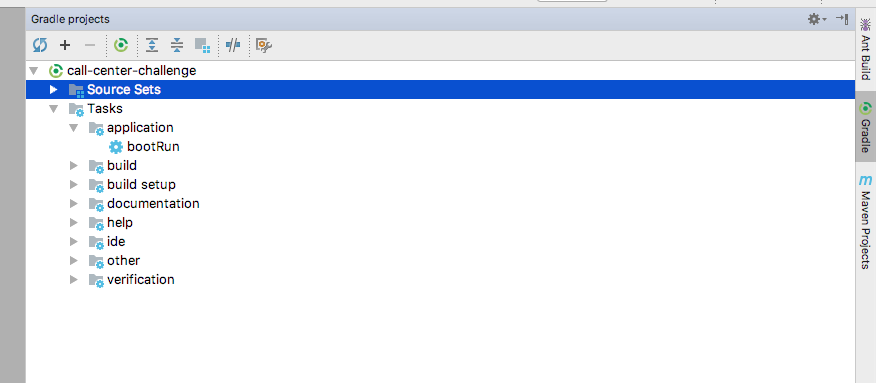
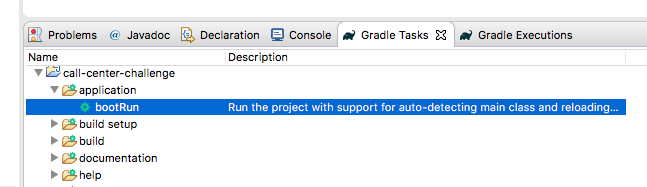
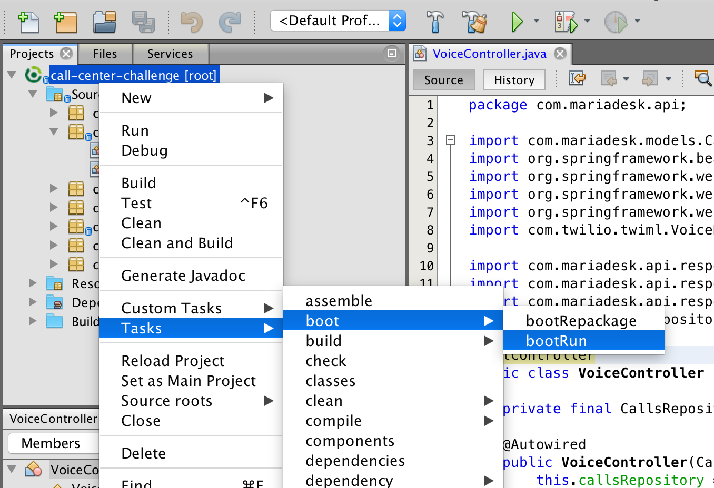

# Call Center Challenge
Maria is an entrepreneur, owns a Flower Shop and wants to improve Customer Support. She decided to have a Call Center that automatically answers common questions and if the customer really needs help, it transfers the call to her number.

# Setup
For this challenge, you'll need to setup your environment with the following set of tools:
- Install [Git](https://git-scm.com/downloads)
- Install [Java 8](http://www.oracle.com/technetwork/pt/java/javase/downloads/jdk8-downloads-2133151.html)
- Install [Gradle](https://gradle.org/install/)
- Install [Heroku CLI](https://devcenter.heroku.com/articles/heroku-cli)
- Install [Ngrok](https://ngrok.com/)
- Install [cURL](https://curl.haxx.se/download.html). This is optional but will help you testing the application HTTP endpoints without having to perform actual calls. As an alternative, you can use a GUI based application such as [Postman](https://www.getpostman.com/) for the same effect.

It's highly recommended that you use a Java IDE such as [Intellij IDEA (Community)](https://www.jetbrains.com/idea/download/), [Eclipse](http://www.eclipse.org/downloads/packages/eclipse-ide-java-developers/oxygen2), or [NetBeans (Java SE)](https://netbeans.org/downloads/).

## Clone this Repository
Once git is installed on your computer you may clone this repository,

    git clone https://github.com/Talkdesk/call-center-challenge.git

and create a local branch for development.

    git checkout -b <branch-name>

Please follow the convention isep-challenge-group-&lt;*group-number*&gt; when naming your branch.

## Create a Twilio Account
You'll use [Twilio](https://www.twilio.com/) as communication provider, so you need to setup an account in order
to forward calls to your web application. The following steps will guide you into this.

- [Sign up](https://www.twilio.com/try-twilio) for a trial account.
- Let them know you're a human.
- Name your project (e.g. Talkdesk Maria Call Center).
- You're trial account is now set with a budget of $15.50.

## Get a Number
- Under Programmable Voice, choose Numbers.
- Click the Get a Number button.
- Twilio will suggest you a Portuguese phone number. Don't accept it and search for a US number instead (by clicking on the link "Search for a different number"), as you'll be able to make free calls from [Google Hangouts](https://hangouts.google.com/).
- Choose any number from the list that is presented to you.

And you're set. Click "Manage Numbers" and you'll see your brand new phone number listed. You can try it out by making a test call (use Google Hangouts for instance)

For now we're done with Twilio. We'll get back here later to hook your web application to the number you just bought.

# Usage
## Boot the application
Before starting the application, you'll need to set Maria's phone number. Note that this is the number that will be called if the customer feels like the automatic answers aren't enough to solve his problem. Just set the environment variable **AGENT_NUMBER** with your number:  

Linux/macOS

    export AGENT_NUMBER=+351XXXXXXXXX

Windows

    set AGENT_NUMBER=+351XXXXXXXXX

Booting the application is as simple as running the Gradle task **bootRun**.

    gradle bootRun

The previous command will compile and package the project and deploys it in a bundled *tomcat* listening on port 8080. In the end of the process, you should see a message similar to:

    com.mariadesk.Application: Started Application in 9.61 seconds (JVM running for 10.149)

You can verify that the application is running as expected by making a HTTP request to the /voice/inbound endpoint.

    curl -v -X POST http://localhost:8080/voice/inbound?To=test&From=test&Caller=test&CallSid=test&AccountSid=test

The service is expected to respond with status code `200`.

Finally, create a tunnel so that your local application can be accessed from the internet

    ngrok http 8080

## IDE setup tips
### Intellij
Intellij is shipped with Gradle support, so you'll just need to import the project:
- Go to "File" > "Import project" and select the project's base directory.
- Mark "Import project from external model" and select "Gradle". If you need additional help, check the official [documentation](https://www.jetbrains.com/help/idea/gradle.html#gradle_import)
- Keep the suggested settings and click "Finish".
- All dependencies are resolved automatically.
- You can boot the application directly from Intellij. In the "Gradle Projects" you'll find the *application > bootRun* task; if you double click it, the task runs and the application starts.

  

### Eclipse
- Make sure you have [Buildship](http://www.vogella.com/tutorials/EclipseGradle/article.html#install-eclipse-gradle-buildship-tooling) plugins installed in Eclipse. If you've downloaded Eclipse recently this should be bundled already.
- Import the project as described [here](http://www.vogella.com/tutorials/EclipseGradle/article.html#import-an-existing-gradle-project)
- All dependencies are resolved automatically, so the project should present zero errors.
- You can boot the application directly from Eclipse. In the "Gradle Tasks" view you'll find the *application > bootRun* task; if you double click it, the task runs and the application starts.

  

### NetBeans
- Install the [Gradle Support](http://plugins.netbeans.org/plugin/44510/gradle-support).
- Select "Open Project" under "File" and import the directory where you cloned this repository to.
- All dependencies are resolved automatically, so the project should present zero errors.
- You can boot the application directly from NetBeans. Right click the project name and run the *bootRun* task.

## Setup webhook in Twilio
- In your twilio account, access the list of "Phone Numbers".
- Click on the phone number you've just [provisioned](#get-a-number).
- In the "Voice & Fax" section configure the "A call comes in" Webhook to point to your local application (through the ngrok tunnel). The endpoint must be set as `https://<ngrok_url>/voice/inbound` where *ngrok_url* should be replaced by the Url that was assigned by ngrok.
      Example: https://44a1dcb5.ngrok.io/voice/inbound
- Save the settings and make a test call.

# Suggested Documentation
## Heroku
- [Deploying to Heroku](heroku.md)

## Twilio
- [Java Quick Start: Say a message](https://www.twilio.com/docs/quickstart/java/twiml/say-response#before-you-start)
- [Java Quick Start: Connect call to second person](https://www.twilio.com/docs/quickstart/java/twiml/connect-call-to-second-person)
